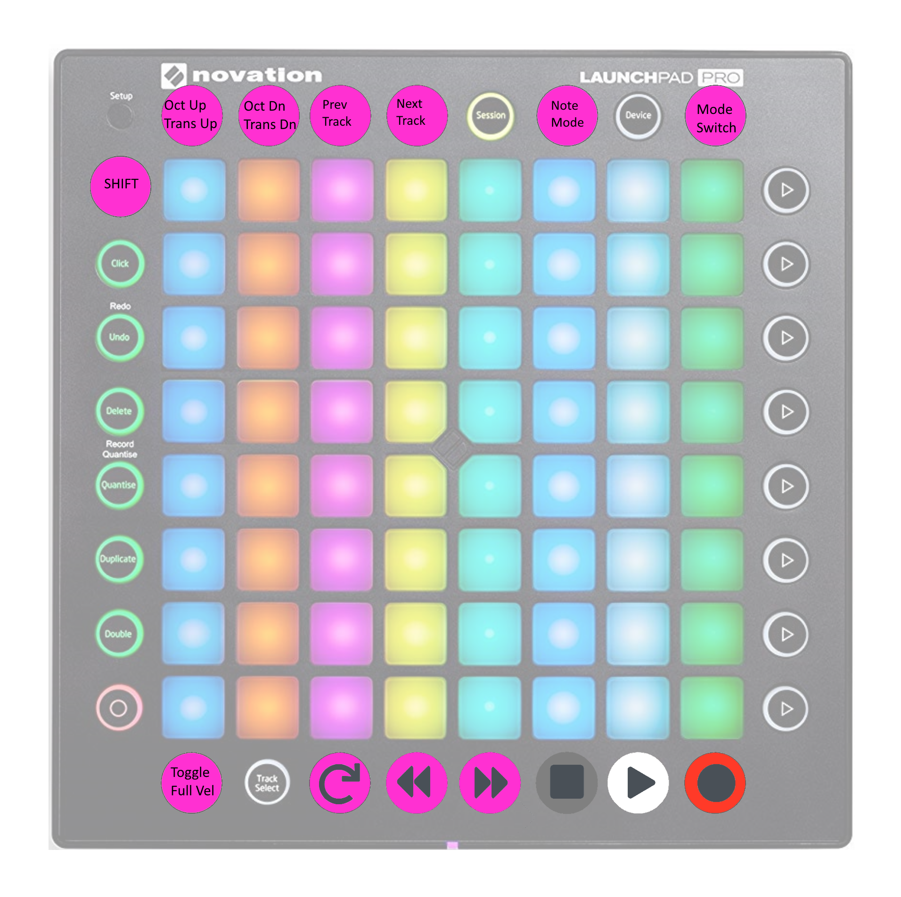
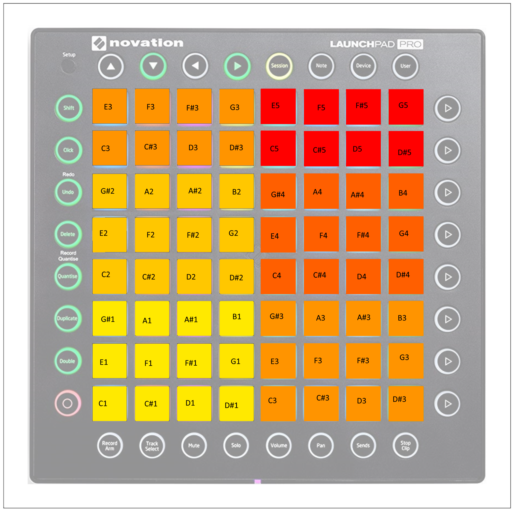
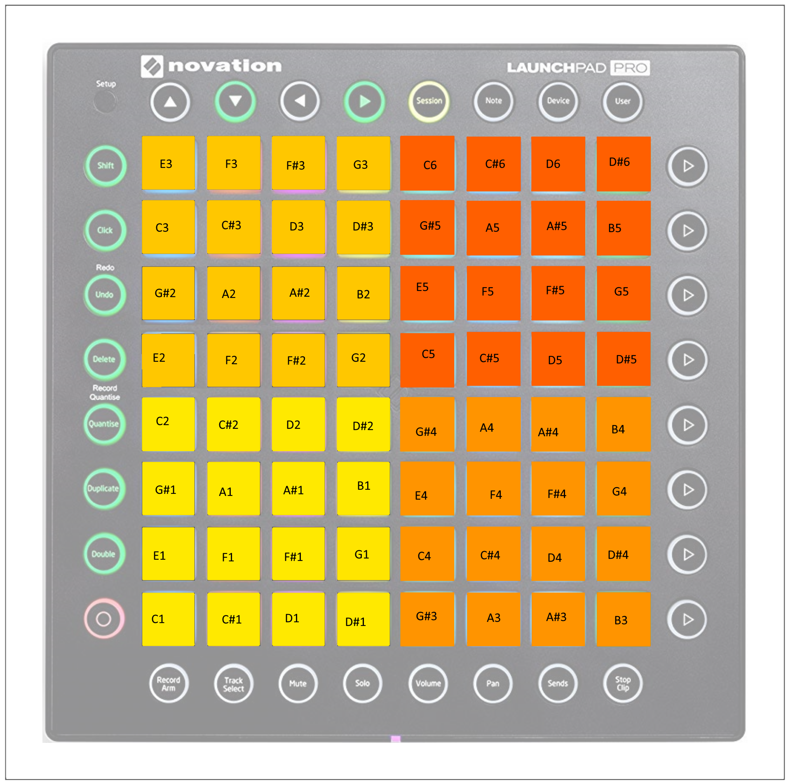
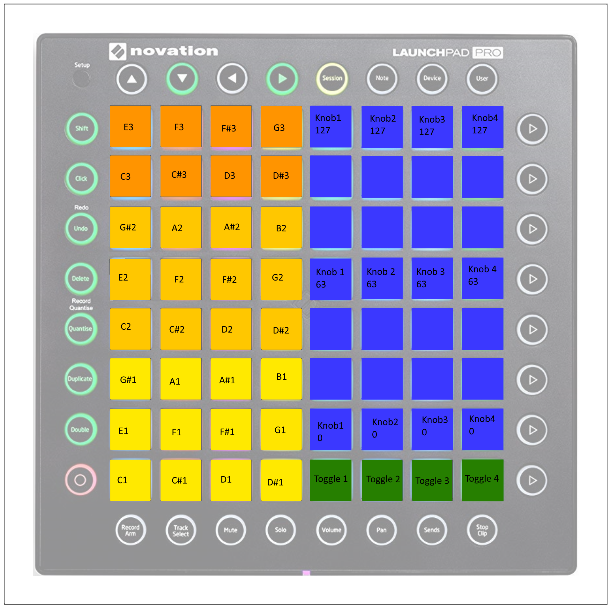
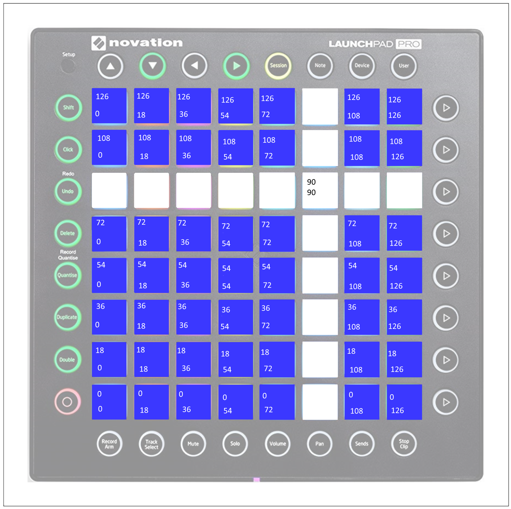

# Launchpad Pro

Open-source firmware for the Novation Launchpad Pro grid controller! This project is based on [dvhdr's launchpad-pro project](https://github.com/dvhdr/launchpad-pro).

This firmware was developed for use with Reason Studio's Reason DAW.

# Installing the Firmware

If you can't (or don't want to) build the project from source, you can simply send the `launchpad_pro.syx` file (in the `build` directory) to your Launchpad Pro.
I use [MIDI-OX](http://www.midiox.com/) to send the firmware through, but there are other tools that can do that too.

1. Turn off your Launchpad Pro
2. While holding the "Setup" button, turn on your Launchpad Pro
3. Launch MIDI-OX 
4. Select your Launchpad Pro as an Output device (Options - Midi Devices - Midi Outputs)
5. Actions - Send - SysEx file
6. Select the sysex file (launchpad_pro.syx)
7. Wait for the send to complete
8. Done!

# Installing the Reason Remote Map

For use with Reason, you will also need to install the Remote mapping files:
- `reasonlpp.midicodec`
- `reasonlpp.remotemap`

On Windows, these are the paths where to install those files:
- C:\ProgramData\Propellerhead Software\Remote\Codecs\MIDI Codecs\reasonlpp.midicodec
- C:\ProgramData\Propellerhead Software\Remote\Maps\Other\reasonlpp.remotemap

# Usage

For a quick visual example and explanation of this firmware's feature, see the demo video here:

[TBD]

## Global Utilities

### Modes

Cycle through the modes by pressing the `Mode Switch` button (labeled `User` on the LPP).
Toggle keyboard/kong note mode by pressing the `Note Switch` button (labeled `Note` on the LPP).

### MIDI Transport Controls

MIDI transport buttons are defined on the very bottom row.

- Toggle Loop: `Mute` button on the LPP
- Rewind: `Solo` button on the LPP
- Fast Forward: `Volume` button on the LPP
- Stop: `Pan` button on the LPP
- Play: `Sends` button on the LPP
- Record: `Stop Clip` button on the LPP

### Velocity Toggle

The bottom-left button (labeled `Record Arm` on the LPP) toggles between full-velocity and velocity-sensitive modeds for MIDI notes sent from the LPP.

### Transpose

To transpose the notes sent by the LPP, use the `Up` and `Down` buttons (top-left of the LPP).
- `Up`: Transpose one full octave up
- `Down`: Transpose one full octave down
- `Shift Up`: Transpose one semi-tone up
- `Shift Down`: Transpose one semi-tone down

### Track Selection

To switch target tracks in Reason, use the `Left` and `Right` buttons (top row of the LPP).

## Modes

### Notes

This is the default mode for the LPP.
In this mode, each square pad is a note.

In "Keyboard" note mode, each color represents one full octave.
In "Kong" note mode, each color is a set of 16 MIDI notes, allowing you to set up one combinator with four Kongs, each responding to a set of 16 square buttons.

#### Keyboard Note Mode

#### Kong Note Mode

### Combinator

In this mode, the left half of the square buttons represents a keyboard (or two Kongs). The right half is used to control the Combinator's rotary and toggle controls.

### X/Y

In this mode, the full grid represents a two-dimensional control for two CC values.

When targeting a Combinator, X is Rotary 1 and Y is Rotary 2.

### Mixer

#### Mixer 14:2

When targeting a Mixer 14:2, the blue buttons represent the first eight channel volumes on the mixer and the green buttons represent the "Solo" toggle for the first eight channels on the mixer.

#### Line Mixer 6:2

When targetting a Line Mixer 6:2, columns 1-6 of blue buttons represent the first fix channel volumes, column 7 controls the main Aux return level, and column 8 controls the master volume on the mixer.
The first six green buttons control each channel's "Solo". Green buttons 6 and 7 do nothing.

# MIDI Implementation

## CC Values

### MIDI Transport

MIDI transport uses the following CCs:
- Play: `16`
- Stop: `10`
- Record: `12`
- Loop: `13`
- Rewind: `15`
- Fast Forward: `14`
- Previous Track: `20`
- Next Track: `21`

### Combinator Mode

In Combinator mode:
- Faders (blue pads) control CCs `44` through `47`
- Toggles (green pads) control CCs `54` through `57`

### Mixer Mode

In Mixer mode:
- Faders (blue pads) control CCs `40` through `47`
- Toggles (green pads) control CCs `50` through `57`

### X/Y Mode

In X/Y mode:
- X controls CC `44`
- Y controls CC `45`

# Notes

## Aftertouch

Each note pad is aftertouch-sensitive, sending MIDI aftertouch based on pad pressure.

## Dithering

Since the fader/rotary controls have a limited resolution, I implemented progressive CC changes where appropriate.
This means that moving a fader between 0 and 100% will not happen instantaneously, but smoothly. This avoids unintended glitchy parameter changes.