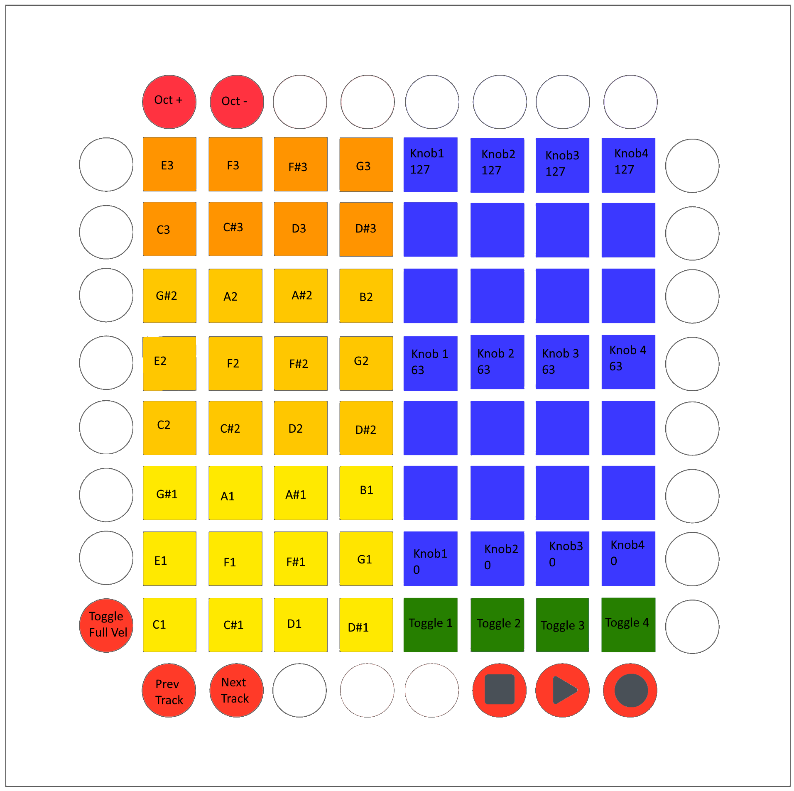

# Reason Launchpad Pro Firmware

This project is a fork of Dave Hodder's open-source Launchpad Pro firmware (https://github.com/dvhdr/launchpad-pro), with custom instructions to play nice with Reason.

In its current state, this firmware has support for the Reason Combinator.

- The pads in the first four columns are note triggers
- The up/down arrows are octave +/- (minimum 0, maximum 7)
- The bottom row's rightmost pads are combinator toggles
- The other pads are the combinator's knobs
- Play/Stop/Record are not implemented (can't find the right MIDI instruction for these)
- Prev/Next Instrument are not implemented (can't find the right MIDI instruction for these either)

For instructions on using this firmware with your Launchpad Pro, see Dave's instructions here:
https://github.com/dvhdr/launchpad-pro/blob/master/README.md

Button map:
